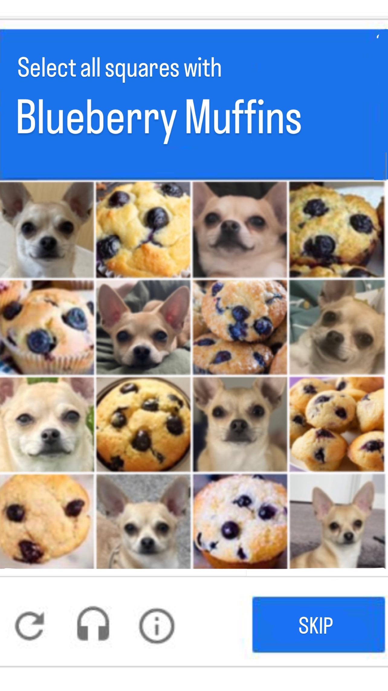
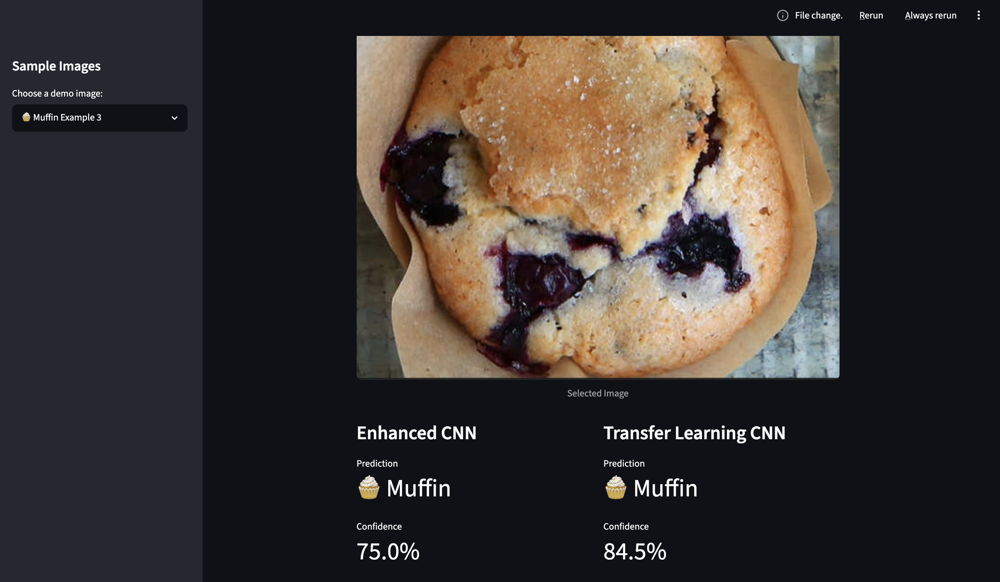

# Muffin vs Chihuahua CNN

This project was inspired by the popular "Muffin vs Chihuahua" internet meme, which highlights how visually similar certain muffins and Chihuahuas can appear. The meme presents a fun image classification challenge that demonstrates the capabilities of Convolutional Neural Networks (CNNs) and Transfer Learning for computer vision tasks:

This is a deep learning image classification project comparing:

- Baseline CNN
- Regularized CNN
- Enhanced CNN
- Transfer Learning CNN (MobileNetV2)

## Final Results

| Model | Accuracy |
|---------|---------:|
| Baseline CNN | 87.67% |
| Regularized CNN | 91.30% |
| Enhanced CNN | 92.57% |
| Transfer Learning CNN | 98.06% |

## Streamlit Application

The project includes a deployed Streamlit application that allows users to:

- Upload their own images
- Use built-in demo images
- Compare predictions from the Enhanced CNN and Transfer Learning CNN

